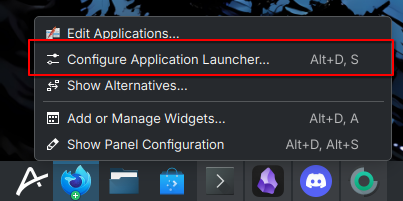
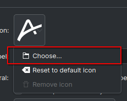
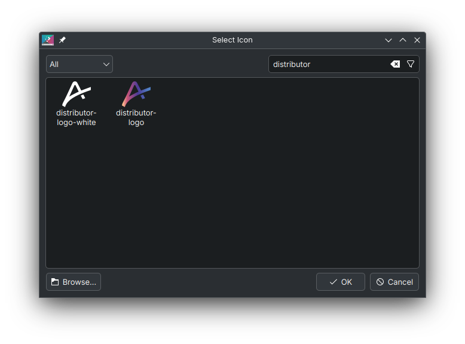

Updating your start icon in Aurora is a straightforward process. You'll have access to both a sleek white version and a vibrant,  colorful option to customize your experience. By default, the colorful version is selected.

1. Firstly, open the settings for the application launcher. This can be done by right clicking the application launcher icon on your taskbar. It will show a menu, select "Configure Application Launcher".

2. In the screen that opens, click on the Aurora Logo Button and then click "Choose". This will open another window with lots of icons. 

3. Last step: In the dropdown on the left, select "All icons" from the list. Then type in "distributor" in the search / input field and you should see the two logos that are currently included by default with your Aurora installation.

That's it! You've successfully changed your icon. Btw, you can also select custom icons here if you search for them via the file picker 😉 (click on the browse button on the bottom left).

